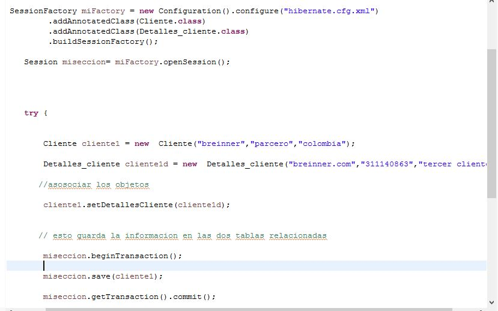
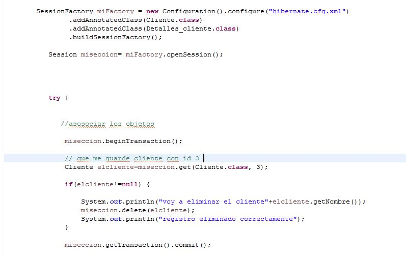
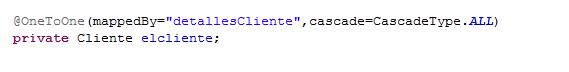
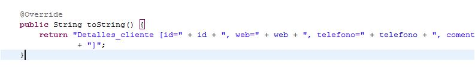
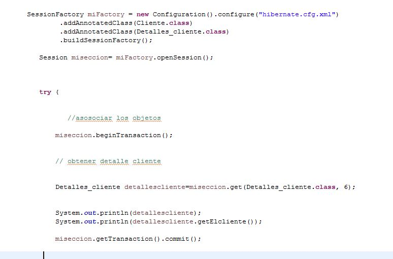

# JPA con Hibernate Practica 
### 1) se crea primero una base de datos con dos entidades relacionadas uno a uno  en MySQLWorkbench
###  tambien configuracion de archivo xml Hibernate para conexion a base de datos  
###  los datos ingresados en la clase cliente y detallescliente se hacen atraves de Hibernate imagenes parte de abajo
___

 

___

## hibernate.cfg.xml

___

___
### 2)  se crea la clase Clientes y  detallecliente con con sus setter y getter  mas etiquetas de jpa que usa hibernate
### se le asigna clientes y detalle cliente  para realizar consultas   

### Cliente

## mas etiquetas jpa para especificar columnas 

___
esta parte del codigo y etiquetas indican la clave foranea de la entidad hija en la base de datos como tambien las modificaciones que afectan entre tablas 
unidericional: cliente->detalles 
~~~
@OneToOne(cascade=CascadeType.ALL)
	@JoinColumn(name="id_Detalle")
	private Detalles_cliente detallesCliente;
~~~

___

### detallesCliente

## mas etiquetas jpa para especificar columnas 

___
### 3)  ingreso de datos en las entidades con conexion a base de datos desde java hibernate

___

## se realizan tambien eliminacion de datos 

### 4) se actualiza archivos se encuentran en paquetebidirecional se agrega etiqueta con mapeo en detalles_Cliente
### para que sea biderecional 

___

## se agreaga toString para ver objetos en la clase nueva ObtenerCliente.java

___

## clase nueva ObtenerCliente.java trae informacion de entidad detalles  mas las del cliente,  Bidirecional <==>

